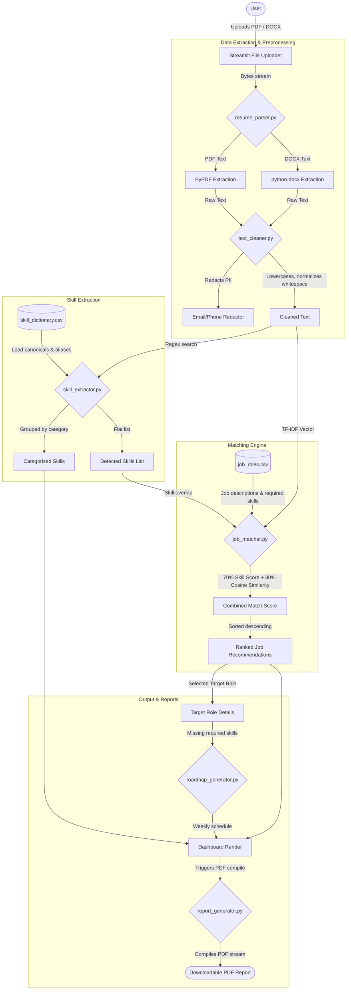

# System Architecture

Below is a detailed Mermaid diagram representing the flow of data and modules in the AI Resume Analyzer and Job Recommendation System.

### Module Descriptions

1. **`resume_parser.py`**: Reads binary streams directly in memory. Splits pages and handles document cells or paragraphs cleanly.
2. **`text_cleaner.py`**: Performs character cleaning. It leaves technical symbols untouched (such as `+` in `C++` or `#` in `C#`) and masks contact info fields using pattern replacements.
3. **`skill_extractor.py`**: Runs case-insensitive search queries using positive and negative lookarounds to match only whole words.
4. **`job_matcher.py`**: Calculates keyword coverage and fits a TF-IDF text representation on the resume text and preset job profiles to calculate structural matching scores.
5. **`roadmap_generator.py`**: Produces scheduled tasks dynamically mapped to missing technical requirements.
6. **`report_generator.py`**: Compiles an in-memory binary PDF document utilizing ReportLab's SimpleDocTemplate and flowable elements.
